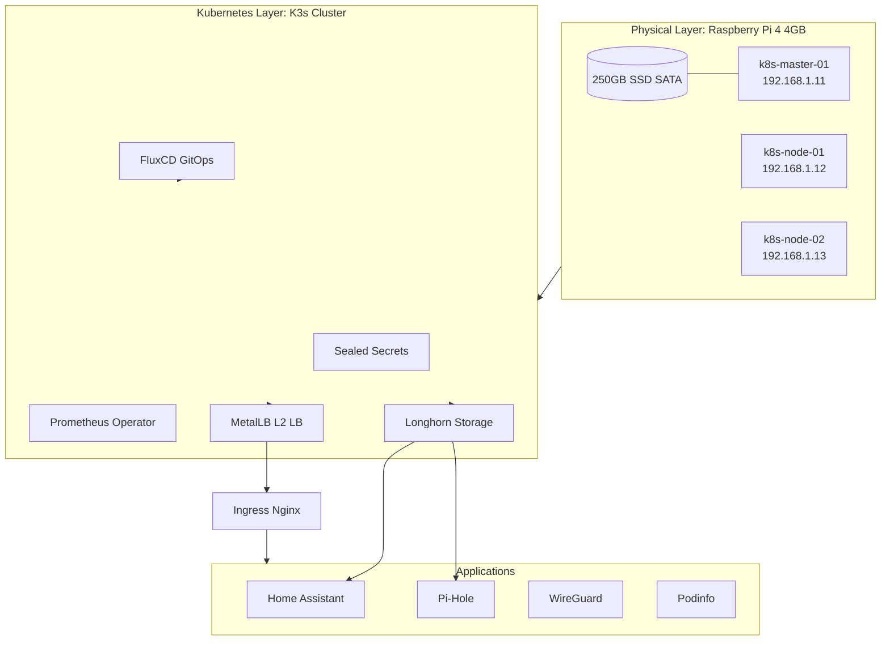

> DRAFT - WORK IN PROGRESS
# Description
Last year my wife came to me a said: "Oren you should start a project so you will have something to do outside of work", So I created this repository :grin:

This repo holds all the configuration and documentation that is needed to set up my self-hosting home Kubernetes cluster on raspberry pie boards.

## Project Goals

- The goal of the project is to fully automate my hosting environment at home. 
- To have the entire state of the environment declared in GIT
- Learn and implement the latest DevOps tools and methods.
## Architecture



### Stack Components

- **Infrastructure**
  - [FluxCD - GitOps Toolkit](https://fluxcd.io/)
  - [K3S - Kubernetes Distro](https://k3s.io/)
  - [METALLB - Layer 2 LB](https://metallb.universe.tf/)
  - [LongHorn - Distributed storage for K8S](https://rancher.com/products/longhorn/)
  - [Ingress Nginx - Ingress Controller](https://kubernetes.github.io/ingress-nginx/)
  - [Cert-Manager - SSL Certificate Management](https://cert-manager.io/)
  - [Kube-Prometheus-Stack - Monitoring & Alerting](https://github.com/prometheus-community/helm-charts)

- **Applications**
  - [Podinfo - Demo app](https://github.com/stefanprodan/podinfo)
  - [Home Assistant - Home Automation](https://www.home-assistant.io/)
  - [Pi-Hole - DNS Ad Blocker](https://pi-hole.net/)
  - [Plex - Media Center](https://www.plex.tv/)
  - [WireGuard VPN](https://www.wireguard.com/)

## Continues Integration Pipeline [](https://github.com/orenzp/gitops/actions/workflows/test.yaml) --- [](https://github.com/orenzp/gitops/actions/workflows/e2e.yaml)
I use Github Action to enable a Continues Integration solution to check the new code and config that I plan to represent to the system.

  - [GitHub Actions](https://github.com/features/actions) 

# Bootstrapping
The requirements to bootstrapping the Kubernetes Cluster on my raspberry pies. The bootstrap process is divided into two steps. First bootstrap the cluster, then deploy the FluxCD Controller to deploy all my Kubernetes Resources.

- [Cluster Bootstrap](docs/cluster_bootstrap.md)
- [GitOps Bootstrap](docs/gitops_bootstrap.md)

## Automated Setup (Ansible + Bitwarden)
A fully automated setup is available to provision the nodes, install K3s, and bootstrap FluxCD.

### 1. Provision Nodes
Flash your SD cards and follow the [Node Setup Guide](node_setup/readme.md) to enable **root login** with a preset password and static IP.

### 2. Login to Bitwarden
Ensure the Bitwarden CLI (`bw`) is installed and authenticated on your machine:
```bash
bw login
export BW_SESSION=$(bw unlock --raw)
```

### 3. Run the Ansible Playbook
Update `ansible/hosts.ini` with your nodes' IPs and then run:
```bash
ansible-playbook -i ansible/hosts.ini ansible/site.yml
```

This single command will:
1.  **Prepare nodes**: Disable swap, enable cgroups, and install K8s dependencies.
2.  **Install K3s**: Deploy the master and join all workers.
3.  **Bootstrap FluxCD**: Fetch your GitHub token from Bitwarden and initialize GitOps on the cluster.
